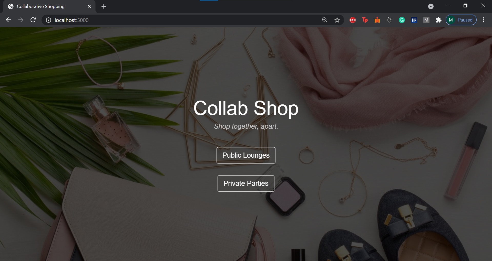
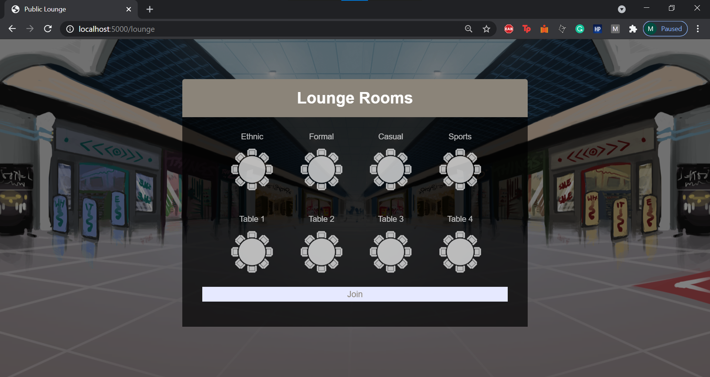
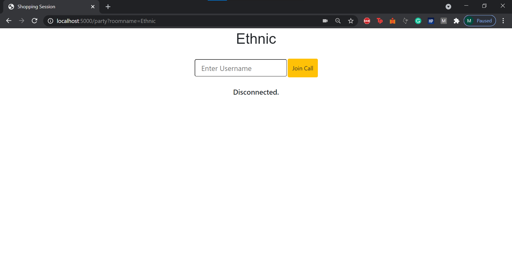
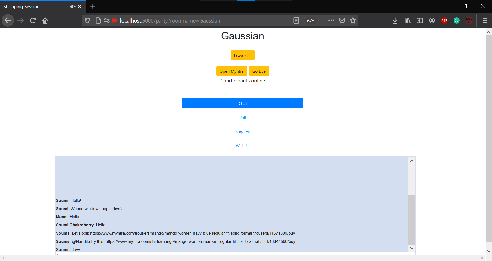
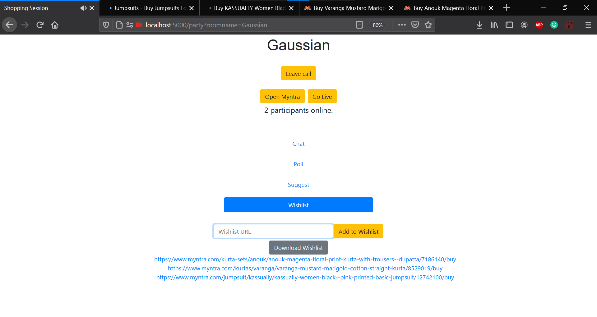
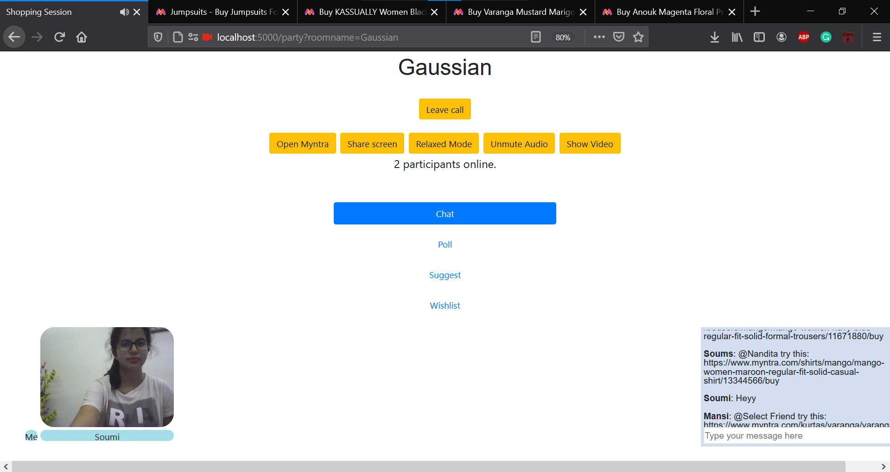
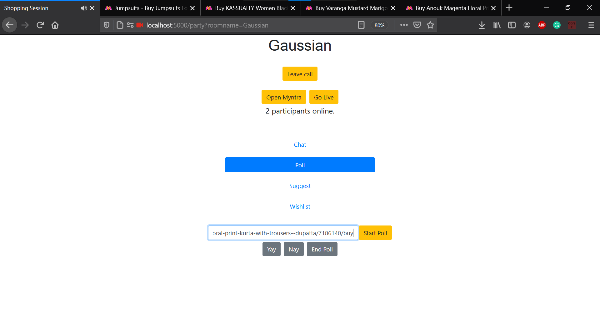
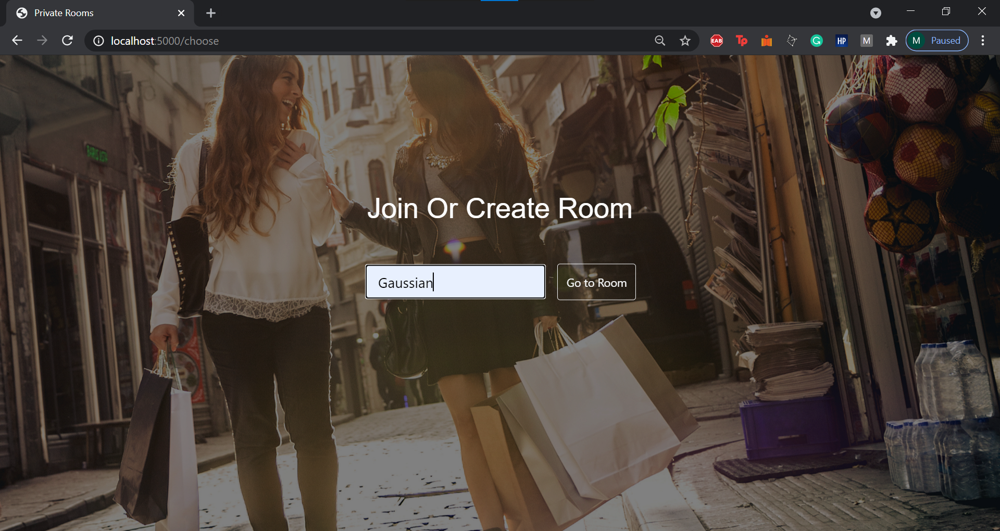

<!-- PROJECT SHIELDS -->

<!-- PROJECT LOGO -->
<br />
<p align="center">
  <h2 align="center">Myntra Hackerramp: Collaborative Shopping</h3>
  <h3 align="center">Gaussian Noise</h4> <br/><br/>
</p>


<!-- TABLE OF CONTENTS -->
<details open="open">
  <summary>Table of Contents</summary>
  <ol>
    <li>
      <a href="#about-the-project">About The Project</a>
    </li>
    <li><a href="#built-with">Built With</a></li>
    <li>
      <a href="#getting-started">Getting Started</a>
    </li>
  </ol>
</details>

<br/>

<!-- ABOUT THE PROJECT -->
## About The Project

This is a solution to the problem statement of "Collaborative Shopping" by Myntra. We have built a platform that allows you to communicate with friends, family and co-shoppers as you browse the products in Myntra's site. The platform offers two modes: relaxed and real-time. In relaxed mode, you can chat with the members in your group, poll on items, and add products to wishlist. In the real-time mode, you have the option to switch on your audio, video (and the option to turn them off as well), screenshare the Myntra site via the "Share screen" option, and chat as well! 
<br/><br/>
Members of the team:
* Mansi Nanavati
* Nandita LT
* Soumi Chakraborty

## Built With

The major frameworks that are used to build this project are:
* [Twilio](https://www.twilio.com/) - To set up API that forms the backend storing usernames, Room names. It is even used to add video, audio and chat tracks in the application.
* Vanilla JS - To carry out the functionality of the buttons. It even communicates with the API to facilitate login and polling.
* HTML, CSS, [Bootstrap](https://getbootstrap.com) - The frontend is built using HTML, CSS and CSS by Bootstrap.
* [Flask](https://flask.palletsprojects.com/en/1.1.x/) - It is used to run the app in python.


<!-- GETTING STARTED -->
## Getting Started

The following are the instructions to be followed while setting up the application locally. Once you have set it up, check out the demo.

1. Clone the repo
   ```sh
   git clone https://github.com/boredtea/gaussian-noise.git
   ```
3. Go to the required directory
   ```sh
   cd gaussian-noise\twilio
   ```
3. The application includes a file named .env.template which includes the three configuration variables needed. These are the private values of API. Ideally, the .env shouldn't be public, but for the purpose of the hackathon, we've pushed the .env file as well.
4. Create and start a Python virtual environment
   ```sh
   python -m venv venv
   venv\Scripts\activate (for windows)
   source venv\bin\activate (for linux)

   ```
5. Run the application using flask
   ```sh
   python wsgi.py
   ```
   The application is now running on [http://localhost:5000/](http://localhost:5000/). Head over to localhost:5000 in your machine.
6. Alternatively, the application has been deployed on [Heroku](https://gaussian-noise.herokuapp.com/)


## Demo
1. Home page displaying Public and Private lounges 
2. Rooms in public lounge 
2. Enter username 
2. Relaxed Mode 
2. Wishlist 
2. Save wishlist before leaving call 
2. Live mode 
2. Poll 
2. Poll results 
2. Enter unique room name in private parties 
